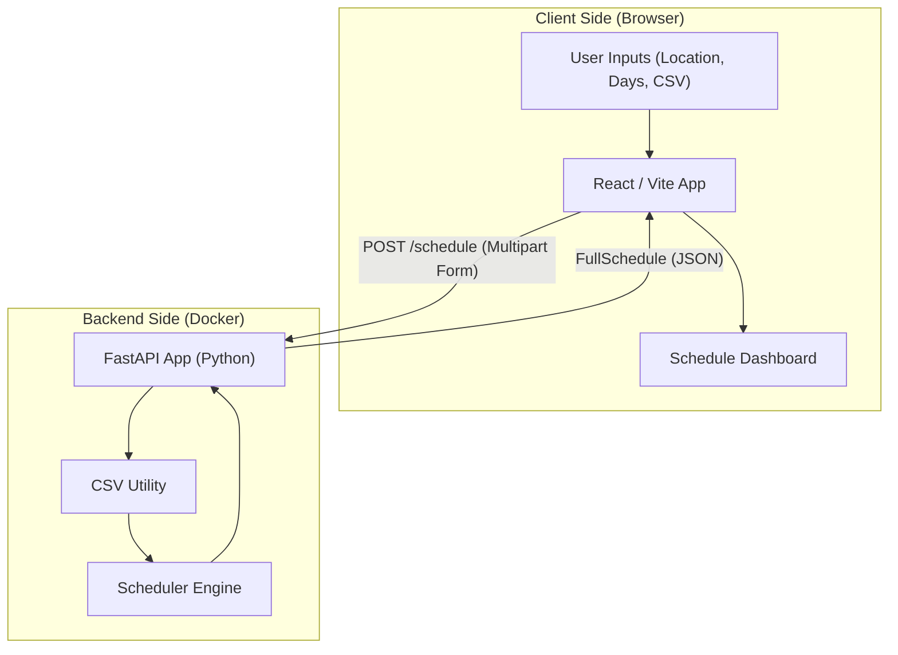

# Project Architecture

This document provides a high-level overview of the Volunteer Scheduler system's architecture and its directory structure.

## High-Level Architecture

The system follows a decoupled Client-Server architecture, containerized for easy deployment and isolation.

## Directory Structure

The project is organized into two main services: `backend` and `frontend`.

---
(c) gkhandake 2026. All rights reserved.
