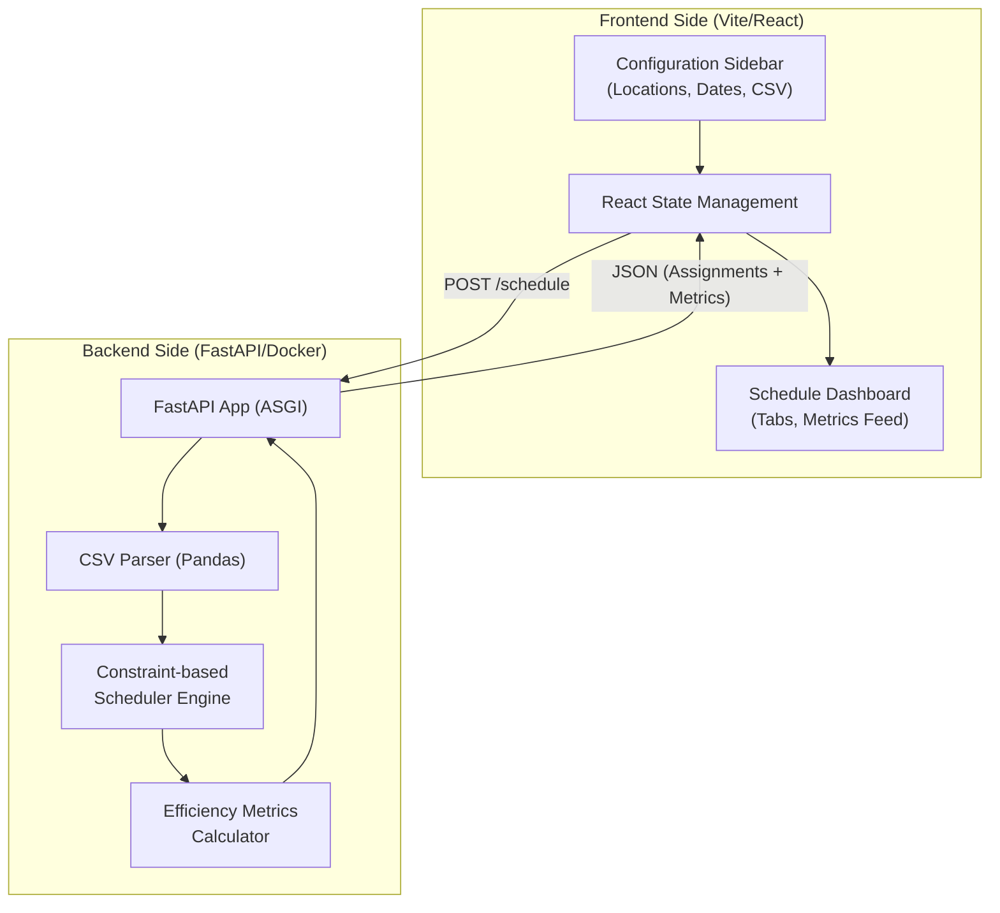

# Project Architecture

This document provides a high-level overview of the Volunteer Scheduler system's architecture and its directory structure.

## High-Level Architecture

The system follows a modern edge-to-edge dashboard architecture, ensuring a seamless user experience for race-day coordination.

## Core Components

- **Frontend**: A React application built with Vite, featuring a responsive CSS Grid layout and independent scrolling sections. It handles multi-date range selection and interactive data visualization (metrics).
- **Backend**: A high-performance FastAPI server. It processes volunteer CSVs using Pandas and implements a custom scheduling algorithm to balance volunteer distribution across locations and slots.
- **Scheduler Engine**: Shuffles and balances volunteers based on location demand, ensuring no slot remains unfilled if resources are available.
- **Metrics Engine**: Calculates real-time staffing statistics including coverage percentage, surplus/deficit counts, and utilization rates.

## Directory Structure

The project is organized into two main services: `backend` and `frontend`.

---
(c) gkhandake 2026. All rights reserved.
